# Deploy static assets

A Github action to pin a static website on IPFS, using the Aleph Network.

The fast and easy way to host your fully decentralized dApp!

1. [**Security Disclaimer**](#security-disclaimer)
1. [**Input parameters**](#input-parameters)
1. [**Output parameters**](#output-parameters)
1. [**Usage & examples**](#usage--examples)
1. [**Workflow detail**](#workflow-details)

---

## Security disclaimer

By using this github action, you acknowledge that the security of your private key is your own responsibility. We recommend that you create a separate account specifically for the use of this github action. We guarantee that we will not collect or store your private key. However, we will not be held liable for any losses or damages resulting from the mismanagement or loss of your private key. It is important that you safeguard your private key and use this service with care.

You can use the built-in secrets feature of GitHub to securely store and manage your private key when using our action. By using the Secrets feature, you can ensure that your private key is kept confidential and secure, and will not be exposed in the logs or in your workflow file. [The Secrets feature is available inside the settings of your repository or organization](https://docs.github.com/en/actions/security-guides/encrypted-secrets).

## Input parameters

This action takes the following input parameters

| Parameter name      | Description                                                                    | Required | Default Value |
| ------------------- | ------------------------------------------------------------------------------ | -------- | ------------- |
| assets_path         | The path to the static assets to pin                                           | no       | `./dist`      |
| artifact_name       | The name of the stic assets artifact                                           | no       | `artifact`    |
| glob_pattern        | The glob pattern to add files from the assets directory into the IPFS instance | no       | `**/*`        |
| message_channel     | The channel that the aleph STORE message will use                              | no       | `GH-ACTION`   |
| blockchain          | Which blockchain should the message be broadcasted on?                         | no       | `ethereum`    |
| account_mnemonic    | Your account mnemonic...                                                       | yes\*    |               |
| account_private_key | ... OR your account private key                                                | yes\*    |               |

\*Provide either one, not both. Not that not all account can be instanciated using mnemonics

## Output parameters

| Parameter name | Description                                                                     |
| -------------- | ------------------------------------------------------------------------------- |
| file_cid       | The IPFS CID of the pinned file or directory                                    |
| file_url       | A direct link to the content on IPFS.io                                         |
| message_hash   | The `item_hash` of the Aleph Store message                                      |
| explorer_url   | A direct link to the message in the [Aleph explorer](https://explorer.aleph.im) |

## Usage & examples

Here is an example of a repository that runs a workflow to build the static assets of a directory using `npm run build `and then uses this action to pin the directory:

```yaml
name: Build and Pin
on: [push]

jobs:
  build:
    runs-on: ubuntu-latest
    steps:
      - name: Checkout code
        uses: actions/checkout@v2
      - name: Install dependencies
        run: npm install
      - name: Build app
        run: npm run build
      - name: Upload artifact
        uses: actions/upload-artifact@v3
        with:
          path: './build'
      - name: Pin assets on IPFS
        id: pin
        uses: aleph-im/aleph-github-actions/publish-static@main
        with:
          account_private_key: ${{ secrets.ETHEREUM_PRIVATE_KEY }}
          assets_path: './build'
      - name: Display file URL
        run: echo "Your static app is available here : ${{ steps.pin.outputs.file_url }}"
```

This workflow is triggered by a push event to the repository. It first checks out the code, installs the dependencies, and runs the build script to build the static assets. It then calls this action and passes the `account_private_key` and `assets_path` input parameters. The `account_private_key` is passed using a repository secret, which can be set in the repository settings under "Secrets".

## Workflow details

### What is IPFS pinning? How does this work using Aleph?

InterPlanetary File System (IPFS) is a decentralized, peer-to-peer file sharing protocol that allows users to store and share data in a distributed file system. Instead of relying on a central server to host files, IPFS uses a distributed network of computers to store and share files. This allows users to access files from anywhere on the network, as long as they have the unique address of the file. IPFS is designed to be scalable, fast, and secure, making it a popular choice for decentralized applications (dApps) and other distributed systems.

In IPFS, "pinning" refers to the process of storing a copy of a file or folder in your local repository, so that it is not deleted when garbage collection runs.

This action starts an instance of IPFS and will generate the unique address (also known as the CID) of the file or folder that you want to pin, then create an Aleph Store message containing CID of these files. The Action would then send the Store message to the Aleph network. This would cause the files to be added to the network and replicated to other nodes. Once the files have been added to the network and replicated to a sufficient number of nodes, they will be considered "pinned" and will not be deleted during garbage collection. You'll be able to access it, at anytime, using `https://ipfs.io/ipfs/[content-cid]`

### Flowchart

The flowchart below is a visual representation of the different steps involved during this github action.

_Workflow goes from top to bottom. Inputs are pictured from left to right_


